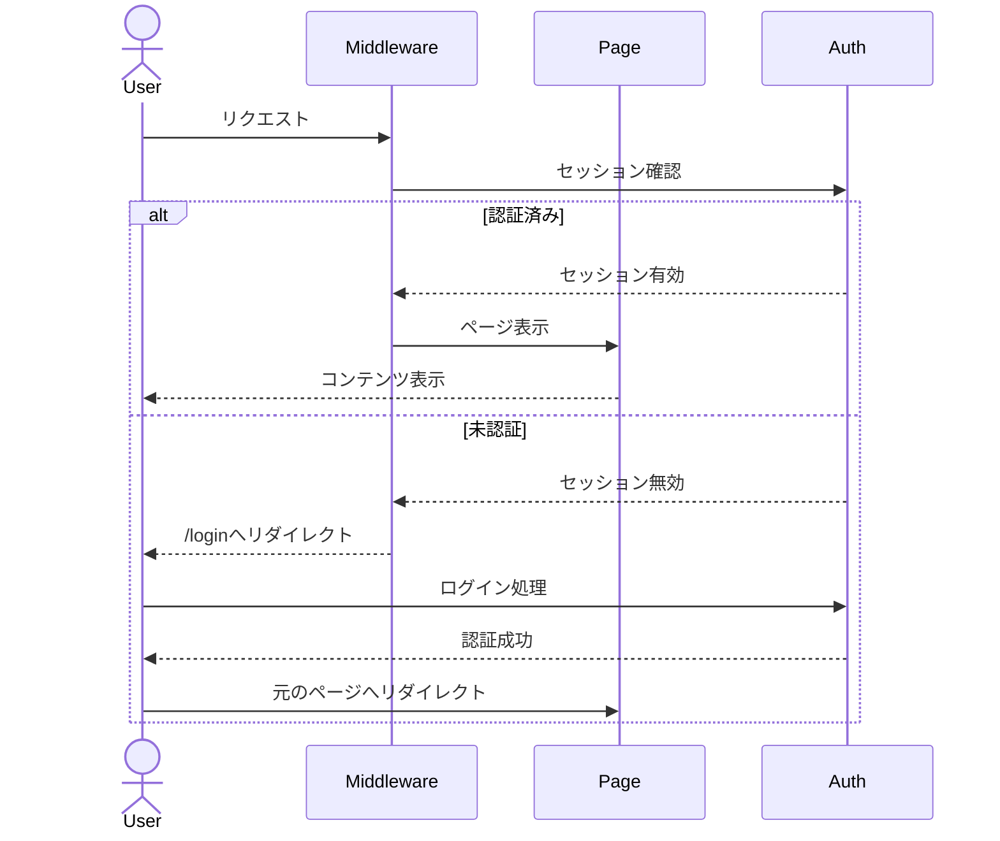
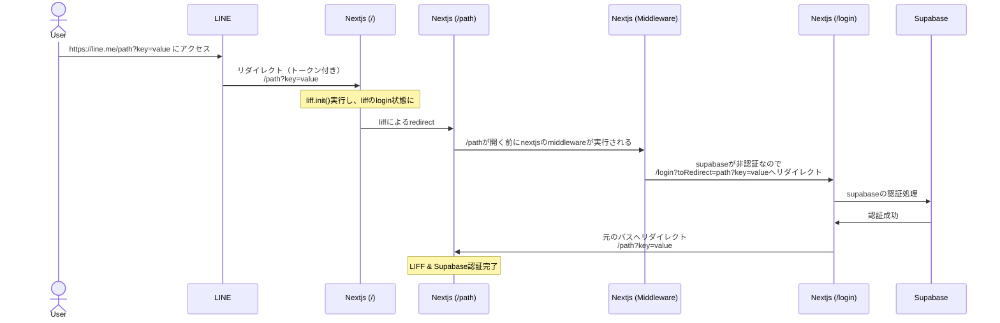
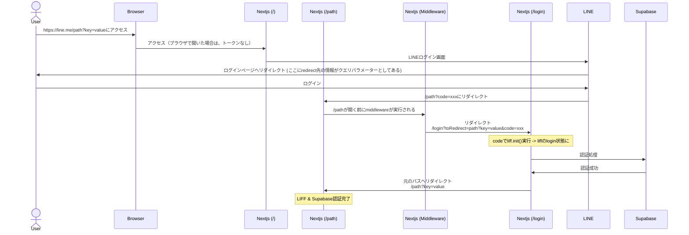
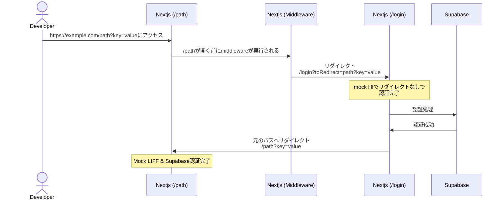

# LIFFとNext.js, Supabaseを組み合わせる

## はじめに

LINEを使ったWebアプリケーションを開発する際、認証周りの実装は複雑で悩みやすいポイントです。
特に以下のような課題に直面することが多いでしょう：

- LINEアプリから開く場合と、ブラウザから直接開く場合で異なる認証フロー
- Next.jsのSSR対応と認証状態の管理
- ユーザーデータの永続化

本記事では、これらの課題を解決するため、LIFF、Next.js、Supabaseを組み合わせた実践的な認証フローの実装方法を紹介します。

## それぞれの認証フローについて

### LIFFの認証フロー
LIFFアプリケーションでは、アクセス経路によって認証フローが異なります。これは、LINEアプリ内での安全な認証と、一般的なWeb認証の両方をサポートする必要があるためです。

#### LINE上でLIFF URLを開いた場合
以下のような複雑な手順で認証が行われます：

1. **初期アクセス**
   - ユーザーがLINE上でLIFF URL（`https://liff.line.me/{liffId}`）を開く
   - LINEのLIFFサーバーにリクエストが送信される

2. **一次リダイレクト**
   - LIFFサーバーは、開発者が指定したエンドポイントURLへユーザーをリダイレクト
   - URLフラグメントとして以下の認証情報が付与される：
     - access_token
     - context_token
     - feature_token
     - id_token

3. **LIFF初期化**
   - アプリケーション側で`liff.init()`を実行
   - 提供されたトークンの検証
   - URLフラグメントからトークン情報が削除される

4. **二次リダイレクト**
   - 最終的な表示URLへリダイレクト
   - この時点で、liff.stateパラメータのみが残る

この流れをフロー図で表すと以下のようになります。

*画像出典: [LINE Developers - リダイレクトフロー](https://developers.line.biz/en/docs/liff/opening-liff-app/#redirect-flow)*

 

#### ブラウザで直接アクセスした場合
通常のOAuth認証フローに近い形で処理されます：

1. **初期アクセス**
   - ブラウザでLIFF URLに直接アクセス
   - LINEログインページへリダイレクト

2. **認証コードの取得**
   - ログイン成功後、`code`パラメータを含むURLへリダイレクト
   - 例：`https://your-app.com/?code=xxx...`

3. **LIFF初期化**
   - `liff.init()`実行時に`code`を使用して認証
   - LINE Platformとの認証処理が実行される

これらの違いを理解することで、後の具体的な実装部分が理解しやすくなります。

どちらの場合も`liff.init()`の実行タイミングが重要になります。
特に`liff.init()`の実行中は、追加のリダイレクトや組み込みルーター機能の使用を避ける必要があります。

### Next.jsの認証フロー
Next.jsではページのレンダリングが始まる前に認証状態を確認し、不要なサーバーサイドの処理を防止する目的で、一般的に以下のような認証フローが実装されます：

1. アクセス時にミドルウェアが認証状態をチェック
2. 未認証の場合は認証ページ（例：`/login`）へリダイレクト
3. 認証後、元のページへリダイレクト

特にSSRを活用する場合、サーバーサイドでの認証状態確認が重要な役割を果たします。




### Supabaseの認証フロー
Supabaseを利用することで、より[セキュアな認証フローを実現できるだけでなく、userごとのデータを管理することができます。](https://www.youtube.com/watch?v=CktZJxXprPY&t=1325s&pp=ygUUbGluZSDoqo3oqLwgZmlyZWJhc2U%3D)

nextjsと組み合わせるときには、SSRのため、クライアントサイドとサーバーサイドの認証フローを組み合わせる必要があります。
[next js ssr で supabase を使う方法](https://supabase.com/docs/guides/auth/server-side/nextjs?queryGroups=router&router=app)
[Next.js with Supabase (nextjs official github example)](https://github.com/vercel/next.js/tree/canary/examples/with-supabase)

## 具体的な認証フローの実装

実際の認証フローは、アプリケーションへのアクセス方法によって主に3つのパターンに分かれます。それぞれのケースで適切に処理を分岐させる必要があります。

### 1. LINEアプリからLIFFを開いた場合

このケースでは、LINEの認証情報を含むトークンが付与された状態でアプリケーションが起動されます。



このフローでは、任意のパス（`/path`）とクエリパラメータ（`key=value`）を含むURLでアクセスでき、認証プロセス全体を通じてこれらの値が維持されます。

### 2. ブラウザで直接開いた場合

ブラウザからの直接アクセスの場合、OAuth形式の認証フローとなります。



### 3. LIFF Mockを使用した開発環境

開発効率を向上させるため、LIFF Mockを使用したフローも実装することをお勧めします。



## 具体的な実装コード
今回、認証フローのsample codeをgithubに公開しました。
[https://github.com/Yongtae723/liff-next-supabase.git](https://github.com/Yongtae723/liff-next-supabase.git)

以下のコードは、先ほどの図で説明したフローを実現するための核となる部分です。
実際のアプリケーションでは、以下のような機能を実装していきます：

✅ LINEアプリからの起動時の自動ログイン
✅ ブラウザからアクセスした際のLINEログインへの誘導
✅ ログイン後の元のページへのリダイレクト
✅ 開発環境でのモックログイン

それでは、具体的なコードを見ていきましょう。
### 1. 共通の認証処理

認証フローの中核となる、LIFFの初期化とSupabase認証の基本処理です。これらの関数は全てのフローで共通して使用されます。

source: [src/utils/auth/liff/liff.ts](https://github.com/Yongtae723/liff-next-supabase/blob/main/src/utils/auth/liff/liff.ts)

```typescript
export async function setupLiff(redirectTo: string): Promise<void> {
	await (process.env.NODE_ENV === "development"
		? setupMockLiff()
		: liff.init({ liffId: LIFF_ID }));

	// following codes are ignored when web is used from liff app.
	if (!liff.isLoggedIn()) {
		const redirectUri = new URL(redirectTo, window.location.origin).href;
		liff.login({ redirectUri });
		return;
	}
}
```

このコードは、LIFFの初期化を行い、未ログインの場合はLINEログインを開始します。`redirectTo`パラメータにより、認証後の遷移先を柔軟に制御できます。

source: [src/utils/auth/supabase.ts](https://github.com/Yongtae723/liff-next-supabase/blob/main/src/utils/auth/supabase.ts)

```typescript
export const loginSupabase = async (): Promise<void> => {
  const lineAccessToken = liff.getAccessToken();
  if (!lineAccessToken) {
    throw new Error("LINE access token not available");
  }
  const { sessionToken, refreshToken } = 
    await fetchSessionFromServer(lineAccessToken);
  await handleSupabaseLogin(sessionToken, refreshToken);
};
```

LIFF認証後に取得したアクセストークンを使用して、Supabaseの認証を行います。これにより、LINEの認証情報とSupabaseの認証情報が紐付けられます。

### 2. LINE アプリからのアクセス処理

LINEアプリからアクセスした際の最初のエントリーポイントとなるページです。このページでLIFF初期化とリダイレクト処理を担当します。

source: [src/app/page.tsx](https://github.com/Yongtae723/liff-next-supabase/blob/main/src/app/page.tsx)

```typescript
"use client";

export default function LiffInitPage() {
  useEffect(() => {
    setupLiff("/home");
  }, []);

  return (
    <div className="flex items-center justify-center h-screen">
      <div className="text-center">
        <div className="animate-spin rounded-full h-10 w-10 border-t-2 border-b-2 border-gray-900 mx-auto" />
        <p className="mt-4 text-lg font-semibold">
          データを読み込んでいます...
        </p>
      </div>
    </div>
  );
}
```

このページはクライアントサイドでレンダリングされ、ユーザーに読み込み中の状態を表示しながら、LIFF初期化とリダイレクトを処理します。

### 3. ブラウザからの直接アクセス処理

ブラウザから直接アクセスした場合の認証ハンドリングを行うページです。URLパラメータを解析し、適切な認証フローを開始します。

source: [src/app/(public)/login/page.tsx](https://github.com/Yongtae723/liff-next-supabase/blob/main/src/app/(public)/login/page.tsx)

```typescript
"use client";

const LoginRedirect = () => {
  useEffect(() => {
    const searchParams = new URLSearchParams(window.location.search);
    const initializeAndRedirect = async () => {
      try {
        const redirectTo = searchParams.get("redirectTo") || "/home";
        await setupLiff(redirectTo);
        await loginSupabase();
        window.location.href = redirectTo;
      } catch (error) {
        // エラー処理
      }
    };

    initializeAndRedirect();
  }, []);
  // ... loading UI
};
```

このページでは、クエリパラメータから遷移先を取得し、LIFF認証とSupabase認証を順次実行します。認証完了後、元のページへリダイレクトします。

### 4. 開発環境でのモック処理

開発効率を向上させるため、LIFF SDKをモック化する処理です。これにより、実際のLINE認証なしでローカル開発が可能になります。

source: [src/utils/auth/liff/liff.ts](https://github.com/Yongtae723/liff-next-supabase/blob/main/src/utils/auth/liff/liff.ts)

```typescript
const setupMockLiff = async (): Promise<void> => {
  liff.use(new LiffMockPlugin());
  await liff.init({
    liffId: LIFF_ID,
    mock: true,
  });

  liff.$mock.set((data: Partial<MockData>) => ({
    ...data,
    isInClient: true,
    getProfile: getMockProfile(TEST_USER_ID),
  }));
};
```

このモック設定により、開発時に実際のLINE認証をバイパスしつつ、本番と同様の動作確認が可能になります。

### 5. ミドルウェアによる認証状態の管理

アプリケーション全体の認証状態を管理し、適切なリダイレクト処理を行うミドルウェアです。

source: [src/middleware.ts](https://github.com/Yongtae723/liff-next-supabase/blob/main/src/middleware.ts)

```typescript
export async function middleware(request: NextRequest) {
  // ... 認証状態の確認
  if (
    !user &&
    !request.nextUrl.pathname.startsWith("/login") &&
    !request.nextUrl.pathname.startsWith("/api") &&
    !(request.nextUrl.pathname === "/")
  ) {
    const redirectUrl = new URL("/login", request.url);
    redirectUrl.searchParams.set("redirectTo", request.nextUrl.pathname);
    return NextResponse.redirect(redirectUrl);
  }
  // ... セッション更新処理
}
```

このミドルウェアは各リクエストをインターセプトし、未認証ユーザーを適切な認証フローへ誘導します。また、認証済みユーザーのセッション管理も行います。

これらのコードが連携することで、LINEアプリ、ブラウザ、開発環境それぞれで適切な認証フローを実現しています。特に重要なのは、各コンポーネントが疎結合を保ちながら、全体として一貫した認証フローを提供している点です。

## まとめ

本記事では、LIFF、Next.js、Supabaseを組み合わせた認証フローについて解説しました。

主なポイントは以下の通りです：

1. **アクセス経路による認証フローの違い**
   - LINEアプリからのアクセス
   - ブラウザからの直接アクセス
   - 開発環境でのモックアクセス

2. **認証の連携**
   - LIFFによるLINE認証
   - Supabaseによるセッション管理
   - Next.jsのミドルウェアによる統合的な制御

3. **開発効率の向上**
   - LIFF Mockの活用
   - 統一的なエラーハンドリング
   - クエリパラメータの維持

これらの実装により、セキュアでユーザーフレンドリーな認証フローを実現することができます。

## 実際のアプリケーション例

本記事で解説した認証フローを実装した実例として、私が開発している「cookLab」をご紹介します。

「cookLab」は、料理好きの方々が簡単にレシピを共有し、お気に入りのレシピを保存できるLINE Bot + LIFFアプリです。

主な機能：
- レシピの検索、解析
- レシピの相談
- 盛り付け例の画像提案
- セール品で作れるレシピの提案
等、料理を楽しめる様々な機能があります。

以下のQRコードまたはリンクから、LINEの公式アカウントを友だち追加して、実際の認証フローと機能を体験してみてください！


ぜひ以下のLINE公式アカウントを友だち追加して、実際の認証フローを体験してみてください！

📱 [LINE公式アカウントを友だち追加](https://line.me/R/oaMessage/@807rpwtd)

実際に使ってみることで、本記事で解説した認証フローがどのように機能しているのか、より理解を深めていただけると思います。また、アプリケーションのソースコードは[GitHub](https://github.com/Yongtae723/liff-next-supabase)で公開していますので、実装の詳細についてもご確認いただけます。

